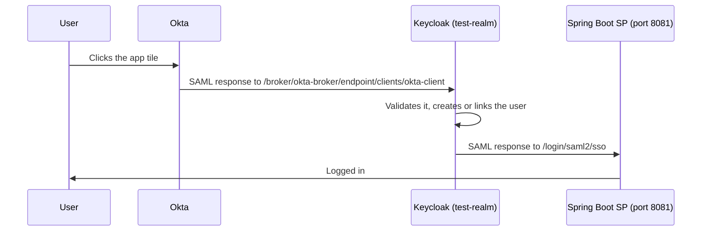

# Phase Two SAML 2.0 example: IdP-initiated SSO with Spring Boot

A Spring Boot SAML 2.0 service provider (SP) that accepts IdP-initiated logins from Keycloak, either with Keycloak as the identity provider or with Keycloak brokering a login that starts in Okta. It is the code for the tutorial [Keycloak SAML Identity Provider (IdP) Initiated Flow with Okta](https://phasetwo.io/blog/keycloak-saml-identity-provider-idp-initiated-flow-with-okta).

## IdP-initiated SSO

In the usual, SP-initiated flow, the user opens the application first. The SP sends a SAML `AuthnRequest` to the identity provider (IdP), the user logs in there, and the IdP posts a SAML `Response` back to the SP's assertion consumer service (ACS). The response refers to the request (`InResponseTo`), so the SP knows it asked for it.

In the IdP-initiated flow, the user starts at the IdP, for example by clicking the application's tile in the Okta dashboard. There is no `AuthnRequest`: the IdP posts an unsolicited `Response` to the SP's ACS. The SP accepts it when it is signed by the IdP it trusts, addressed to its ACS (`Destination`), meant for its entity ID (`Audience`) and still valid. Because an unsolicited response can't be matched to a request, it is more exposed to replay and login CSRF than an SP-initiated one: keep assertion lifetimes short, sign (and, for sensitive attributes, encrypt) assertions, and prefer SP-initiated logins where you can.

## Architecture

The example runs in one of two ways:

- **Keycloak as the IdP** (no Okta needed): the browser opens Keycloak's IdP-initiated SSO URL for the SAML client, the user logs in to Keycloak, and Keycloak posts a SAML response to the SP.
- **Okta, brokered by Keycloak**: the user clicks the app in Okta, Okta posts a SAML response to Keycloak's broker endpoint for the `okta-broker` identity provider, Keycloak validates it, creates or links the user and starts a Keycloak session, and then Keycloak's SAML client posts a new SAML response to the SP.



Without Okta, the flow starts at Keycloak's `/protocol/saml/clients/okta-client` URL instead of the broker endpoint. `okta-client` is the SAML client's "IDP-Initiated SSO URL name", a name from the tutorial: both flows use the same client.

| What                                | Value                                                                                     |
| ----------------------------------- | ----------------------------------------------------------------------------------------- |
| SP entity ID (Keycloak client ID)   | `http://localhost:8081/saml2/metadata`                                                    |
| SP assertion consumer service (ACS) | `http://localhost:8081/login/saml2/sso`                                                   |
| SP single logout service            | `http://localhost:8081/logout/saml2/slo`                                                  |
| SP metadata                         | `http://localhost:8081/saml2/metadata` (also `/saml2/metadata/keycloak`)                  |
| Keycloak IdP metadata               | `http://localhost:8080/realms/test-realm/protocol/saml/descriptor`                        |
| Keycloak IdP-initiated SSO URL      | `http://localhost:8080/realms/test-realm/protocol/saml/clients/okta-client`               |
| Keycloak broker endpoint for Okta   | `http://localhost:8080/realms/test-realm/broker/okta-broker/endpoint/clients/okta-client` |

## The code

- [build.gradle](./build.gradle): Spring Boot 4.1 with `spring-boot-starter-security-saml2`, which brings Spring Security 7.1 and OpenSAML 5. OpenSAML is not published to Maven Central, hence the Shibboleth repository. The build uses a Java 21 toolchain, which Gradle downloads if you don't have one.
- [application.yaml](./src/main/resources/application.yaml) defines the relying party registration `keycloak`: the SP's entity ID, ACS and single logout URLs, its signing key pair, and the URL of Keycloak's IdP metadata, which Spring reads at startup to learn Keycloak's endpoints and signing certificate. `{baseUrl}` is replaced with the URL the request came in on.
- [SecurityConfiguration.java](./src/main/java/com/saml2/idp_initiated/SecurityConfiguration.java) requires a login for every page. `saml2Login` processes SAML responses posted to `/login/saml2/sso` (the registration is found from the response's issuer, so the ACS URL needs no registration ID) and sends users who aren't logged in to Keycloak. `saml2Logout` handles single logout, and `saml2Metadata` publishes the SP metadata, which Spring Boot's default configuration doesn't.
- [RootController.java](./src/main/java/com/saml2/idp_initiated/controllers/RootController.java) and [index.html](./src/main/resources/templates/index.html) show the logged-in user and the decoded assertion: the NameID, the session index and every attribute. They read it through Spring Security 7's `Saml2AssertionAuthentication` and `Saml2ResponseAssertionAccessor`, which replace the deprecated `Saml2AuthenticatedPrincipal`.
- [keycloak/test-realm-export.json](./keycloak/test-realm-export.json) is the `test-realm` realm: the SAML client, a test user and a disabled placeholder for the Okta identity provider. Keep the `-export` suffix: Keycloak's import reads a file named `<name>-realm.json` as the realm `<name>`, so `test-realm.json` would fail to import.
- [scripts/generate-sp-credentials.sh](./scripts/generate-sp-credentials.sh) creates the SP's signing key pair.

## Prerequisites

- Java 17 or newer to run Gradle (the build itself uses Java 21, see above)
- Docker with the Compose plugin
- bash and OpenSSL, to create the key pair (on Windows, use Git Bash or WSL)
- Ports 8080 and 8081 free. If the repository's shared Keycloak is running, stop it first: `docker compose -f keycloak/docker-compose.yml down` from the repository root.
- An Okta account, only for the [Okta flow](#full-flow-with-okta)

## Run it

In `saml2/idp-initiated`:

```sh
./scripts/generate-sp-credentials.sh
docker compose up -d --wait
./gradlew bootRun
```

1. `generate-sp-credentials.sh` writes a 2048-bit RSA key and a self-signed certificate, valid for 10 years, to `credentials/private.key` and `credentials/cert.crt`. The `credentials` folder is ignored by git. Running the script again keeps an existing pair; delete the folder to create a new one.
2. `docker compose up -d --wait` starts a Phase Two Keycloak on port 8080 and imports [keycloak/test-realm-export.json](./keycloak/test-realm-export.json): the realm `test-realm`, the SAML client for this SP and the user `test` / `test`. The admin console is at <http://localhost:8080/admin>, with `admin` / `admin`.
3. `./gradlew bootRun` starts the SP on <http://localhost:8081>. Start Keycloak first: the SP downloads Keycloak's IdP metadata at startup and doesn't start without it. It doesn't start without the key pair either, and then fails with `Private key location 'URL [file:credentials/private.key]' does not exist`.

Opening <http://localhost:8081> starts an SP-initiated login: the SP sends you to Keycloak, and after you log in as `test` / `test`, back to the SP.

Use `localhost` rather than `127.0.0.1`. The SP builds its entity ID and URLs from the host the request came in on, so on `127.0.0.1` it introduces itself as `http://127.0.0.1:8081/saml2/metadata`, which isn't a client in the realm, and Keycloak answers "Invalid Request".

## Quick test without Okta

1. Open Keycloak's IdP-initiated SSO URL for the client: <http://localhost:8080/realms/test-realm/protocol/saml/clients/okta-client>.
2. Log in as `test` / `test`.
3. Keycloak posts a signed SAML response to <http://localhost:8081/login/saml2/sso>, and the SP shows "Authenticated", the NameID `test` and the attributes from the client's mappers: `email`, `firstName` and `lastName`. Keycloak's default `role_list` client scope also sends a `Role` attribute for users who have roles, such as users created in the admin console. The imported `test` user has none.

"Log out" logs you out of both: the SP ends its session and sends a signed `LogoutRequest` to Keycloak, Keycloak ends its session and posts a `LogoutResponse` back to `/logout/saml2/slo`, and the SP shows Spring Security's default login page with "You have been signed out". Its `keycloak` link starts an SP-initiated login.

If a login fails, the SP sends you to the same page with only "Invalid credentials". The reason, for example `invalid_signature` or `invalid_destination`, is logged at trace level:

```sh
./gradlew bootRun --args='--logging.level.org.springframework.security.saml2=TRACE'
```

## Full flow with Okta

The realm has a SAML identity provider `okta-broker` with placeholder values (`your-okta-domain`, `your-okta-app-id`). It is disabled until you connect it to your Okta application.

1. In the Okta admin console, create an app integration with SAML 2.0 as the sign-in method and these settings:

   | Okta setting                | Value                                                                                     |
   | --------------------------- | ----------------------------------------------------------------------------------------- |
   | Single sign-on URL          | `http://localhost:8080/realms/test-realm/broker/okta-broker/endpoint/clients/okta-client` |
   | Audience URI (SP Entity ID) | `http://localhost:8080/realms/test-realm`                                                 |
   | Name ID format              | Unspecified                                                                               |
   | Application username        | Okta username                                                                             |

   Keep "Use this for Recipient URL and Destination URL" checked. Optionally, add the attribute statements `email`, `firstName` and `lastName` (from `user.email`, `user.firstName` and `user.lastName`), then assign the application to your Okta user. The single sign-on URL is Keycloak's broker endpoint followed by `/clients/okta-client`, which tells Keycloak which client to send the user to afterwards.

2. In the Keycloak admin console, open `test-realm` > Identity providers > `okta-broker` and replace the placeholders with the values from the application's Sign On tab in Okta ("View SAML setup instructions", or the metadata URL): the identity provider entity ID (`http://www.okta.com/...`), the single sign-on service URL and Okta's signing certificate. Keep "Validate signatures" on and the service provider entity ID `http://localhost:8080/realms/test-realm`, then enable the provider. You can also delete `okta-broker` and create it again from Okta's metadata, as the tutorial does, as long as you keep the alias `okta-broker`.

3. Open the Okta end-user dashboard and click the application's tile. Okta posts its response to Keycloak, Keycloak posts its own to the SP, and you land on the SP logged in with your Okta username as the NameID. On the first login, Keycloak creates the user and asks you to complete the profile unless Okta sent the email and names and you have added attribute importer mappers for them to `okta-broker`.

## The SP's signing key and the Keycloak client

- Keycloak's IdP metadata says it wants signed authentication requests (`WantAuthnRequestsSigned="true"`), so Spring Boot doesn't start without a signing key. The SP signs its `AuthnRequest`s (SP-initiated logins) and its logout requests with `credentials/private.key`. IdP-initiated logins don't use it: the SP sends nothing, it only verifies Keycloak's signature.
- The imported client has "Client signature required" off (`saml.client.signature` is `false`), so Keycloak doesn't check the SP's signatures and needs no SP certificate. To have them checked, turn it on and give Keycloak `credentials/cert.crt` in the client's Keys tab, or create the client from the SP metadata at <http://localhost:8081/saml2/metadata>, which contains the certificate. After creating a new key pair, update the certificate in Keycloak too.
- Keycloak signs its SAML responses with the realm's own key (Realm settings > Keys). The SP gets the matching certificate from the IdP metadata at startup. Neither side needs the other's private key: an earlier version of this example had you copy a private key from the Keycloak client into the SP, which isn't necessary.
- The certificate's common name is the SP entity ID only to make it easy to recognize. Neither Spring nor Keycloak checks it.

## Using your own Keycloak

To use another Keycloak, for example a [Phase Two](https://phasetwo.io) deployment, either import [keycloak/test-realm-export.json](./keycloak/test-realm-export.json) as a new realm, or create the client in an existing realm:

1. Point `assertingparty.metadata-uri` in [application.yaml](./src/main/resources/application.yaml) at your realm's IdP metadata: `https://<your-keycloak>/realms/<your-realm>/protocol/saml/descriptor`, with `/auth` before `/realms` on Keycloaks that use it, such as Phase Two's.
2. Start the SP, then import its metadata in Keycloak: Clients > Import client, with the file downloaded from <http://localhost:8081/saml2/metadata>. This sets the client ID, the ACS and single logout URLs, and the SP's certificate, and turns "Client signature required" on, so Keycloak checks the SP's signatures.
3. On the client, set "IDP-Initiated SSO URL name" to `okta-client` and check that "Sign documents" is on. Add `email`, `firstName` and `lastName` user property mappers if you want those attributes.

The IdP-initiated SSO URL is then `https://<your-keycloak>/realms/<your-realm>/protocol/saml/clients/okta-client`.

## Tests

```sh
./gradlew build
```

The tests need neither Keycloak nor a key pair, so they run in CI as they are. [src/test/resources/application.yaml](./src/test/resources/application.yaml) replaces the main configuration: it reads the IdP metadata from [test-realm-descriptor.xml](./src/test/resources/test-realm-descriptor.xml), a Keycloak descriptor for `test-realm` with a throwaway certificate, and sets `singlesignon.sign-request: false`, so no signing key is needed. The tests check the SP metadata endpoint, the redirect to the SAML login, the authentication request sent to Keycloak and the page shown after a SAML login.

The [GitHub workflow](../../.github/workflows/saml2-idp-initiated.yml) runs `./gradlew build` with Java 21.

## Stop

```sh
docker compose down
```

Keycloak keeps nothing: the next `docker compose up` imports the realm again, with new signing keys. Restart the SP after that, since it reads Keycloak's certificate only at startup; until then, logins fail with `invalid_signature`.

## Security notes

- Earlier versions of this example committed an SP private key (`src/main/resources/credentials/private.key`) and a Keycloak client private key (in `keycloak/saml-client.json`). They remain in the git history, so they are public: never trust or reuse them.
- `admin` / `admin` and `test` / `test` exist only in the local container.
- The Okta identity provider validates Okta's signatures. Don't turn "Validate signatures" off: Keycloak would then accept any response posted to its broker endpoint.
- Spring Security accepts a response with an `InResponseTo` only in the browser session that sent the request, but it accepts an unsolicited, IdP-initiated response in any session and doesn't remember the responses it has already accepted. A captured response therefore logs in again until it expires: with Keycloak's defaults, about a minute after it is issued, plus the five minutes of clock skew Spring allows. Keep the client's "Assertion Lifespan" short in Keycloak and use HTTPS outside your machine.
